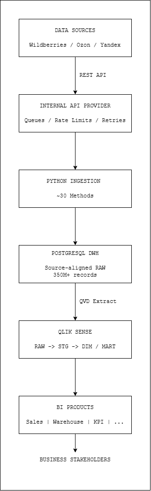
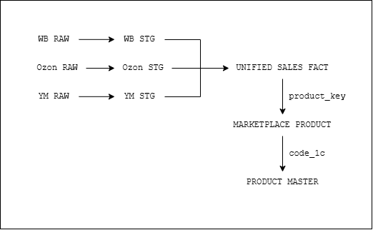
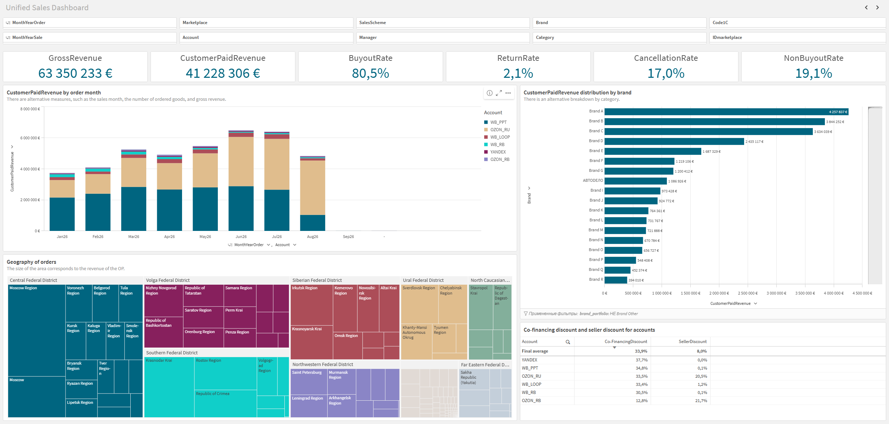
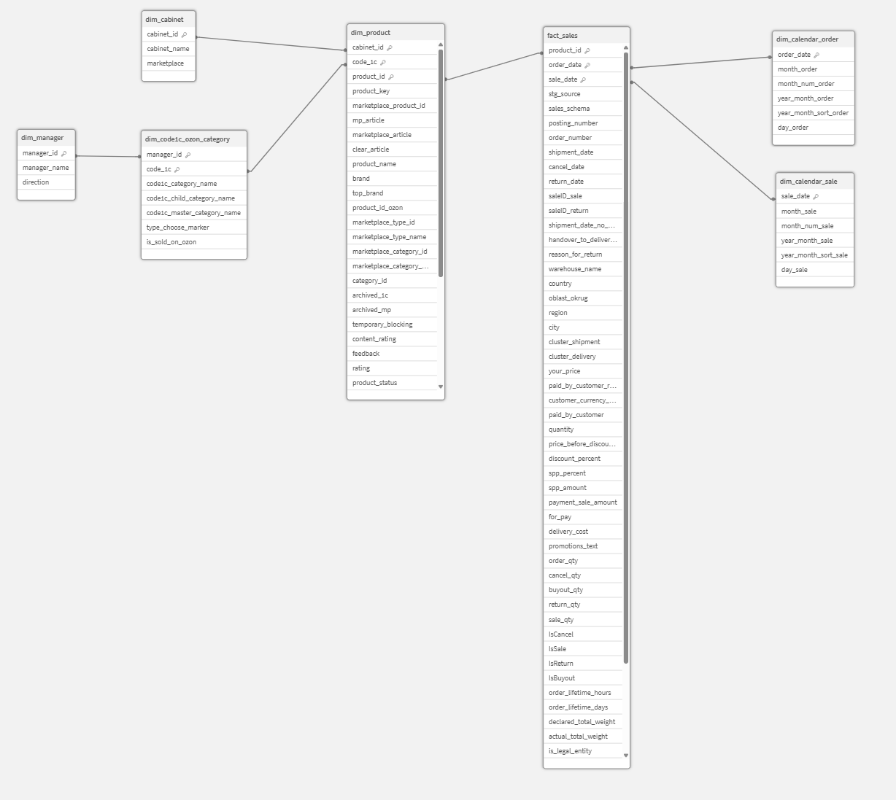
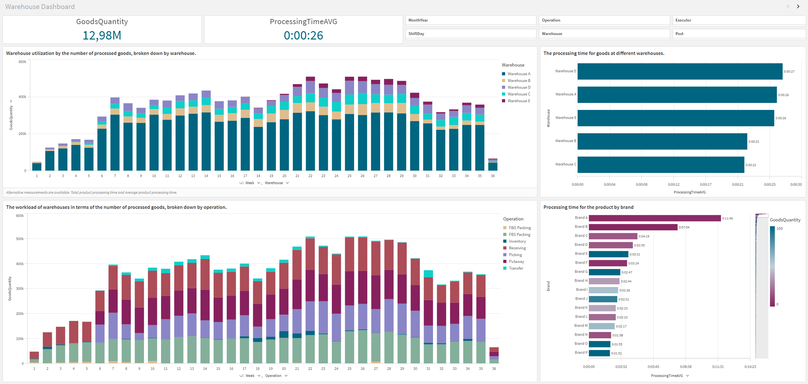
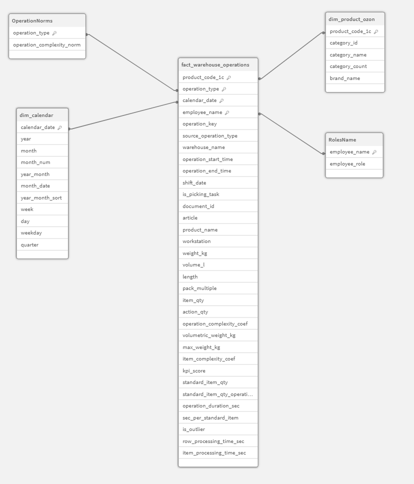

# Marketplace Analytics Platform

> End-to-end analytics platform for a multi-marketplace e-commerce business, integrating Wildberries, Ozon and Yandex Market data into a unified analytical environment.

The platform consolidates marketplace, ERP and operational data into a PostgreSQL DWH and provides reusable analytical models and BI applications in Qlik Sense.

It was built to replace fragmented reporting and manual data preparation with a scalable analytics foundation for sales, assortment, pricing and warehouse operations.

---

## Overview

The project started with a business request to segment and analyze a large marketplace assortment.

The initial analysis quickly revealed a more fundamental problem: the company did not have a centralized analytical data platform.

Historical data was fragmented across marketplace dashboards, APIs, 1C ERP, Excel exports and internal systems. Different teams used different data sources and metric definitions, while important historical data such as stock levels, funnel metrics and search positions was not consistently retained.

Instead of building another isolated report, I proposed and designed a reusable analytics platform that could support both the original assortment task and future analytical use cases.

The resulting solution covers the full analytical flow:

**Data Sources → API Integration → PostgreSQL DWH → Qlik Transformation Layer → Analytical Models → BI Products**

---

## Business Context

The company operates a large marketplace business across:

- Wildberries
- Ozon
- Yandex Market

The assortment consists primarily of automotive parts and includes millions of physical products and marketplace listings distributed across multiple seller accounts and fulfillment models.

Before the project, there was no dedicated analytical platform or unified BI environment.

Marketplace managers primarily relied on:

- marketplace native dashboards;
- 1C reports;
- manual Excel exports;
- ad-hoc API extracts.

Answering a new cross-marketplace business question could take from several hours to several days, and some analyses could not be reproduced historically because the required data had never been stored.

---

## The Problem

The main challenges were not visualization-related. They were caused by the absence of a consistent analytical data foundation.

### Fragmented data

Wildberries, Ozon and Yandex Market expose different entities, identifiers, statuses and business logic.

The same business concept — for example, an order, sale, cancellation or return — can be represented differently across marketplace APIs.

### No unified product model

A single physical product may have multiple marketplace listings and marketplace-specific identifiers.

Without a common product key, cross-marketplace product analytics was difficult to maintain consistently.

### Missing historical data

Some marketplace interfaces provide only limited historical visibility.

Without regularly collecting API data, it was impossible to reliably analyze historical stock levels, search positions, funnel metrics and other operational indicators.

### Inconsistent metrics

Different reports and teams could calculate revenue, buyouts, cancellations and returns using different logic.

This created multiple versions of the same business metric.

### Limited scalability

Manual Excel-based analysis could work for individual questions but could not support millions of products, multiple marketplaces and recurring analytical workflows.

---

## My Role

**Role:** Data Analyst / Analytics Platform Owner

I was hired as a Data Analyst and became responsible for the analytical design and development of the platform.

My responsibilities included:

- gathering analytical requirements from business stakeholders;
- identifying and evaluating marketplace API methods;
- defining required datasets, update strategies, keys and expected data grain;
- specifying full and incremental ingestion requirements;
- validating ingested data against APIs and source systems;
- designing the analytical architecture;
- selecting PostgreSQL and Qlik Sense as the core analytical stack;
- designing RAW, staging, dimension and mart structures;
- writing SQL for validation and analysis;
- developing Qlik transformation logic and QVD layers;
- designing unified marketplace data models;
- developing BI applications and business metrics;
- administering the Qlik Sense analytical environment;
- prioritizing further development of the analytical platform.

Production API ingestion was implemented by a Python developer based on the analytical specifications I prepared.

Infrastructure and virtual machine administration were handled by the system administrator.

This allowed me to focus on analytical architecture, data modeling, validation and business-facing analytics rather than infrastructure engineering.

---

## Scale

| Metric | Scale |
|---|---:|
| Physical product assortment | **2M+ products** |
| Marketplace listings | **5M+ listings** |
| Seller accounts | **6** |
| Daily orders | **10K+** |
| Analytical data | **350M+ records** |
| PostgreSQL DWH | **150GB+** |
| Marketplace API methods | **~30** |
| BI users | **10+** |
| Marketplaces | **Wildberries, Ozon, Yandex Market** |

The platform supports a multi-billion-ruble marketplace business and continues to grow as new analytical use cases are added.

---

## Solution Architecture



The analytical platform consists of several layers.

### 1. Data Sources

The main data sources include:

- Wildberries API;
- Ozon API;
- Yandex Market API;
- 1C ERP;
- internal product and operational systems.

### 2. Internal API Provider

Marketplace API requests pass through an internal API service responsible for:

- request queues;
- marketplace rate limits;
- retries.

### 3. Python Ingestion

Approximately 30 API methods are collected on scheduled loads.

For each dataset, the analytical specification defines:

- API method;
- required fields;
- pagination logic;
- full or incremental loading strategy;
- business keys;
- expected grain;
- duplicate handling;
- validation requirements.

Individual ingestion processes are independent, so failure of one source does not stop the entire data load.

### 4. PostgreSQL DWH

Source data is stored in PostgreSQL in source-aligned RAW tables.

The DWH currently contains more than 350 million records.

### 5. Qlik Analytical Layer

Data is extracted from PostgreSQL into QVD files and transformed through:

**RAW → STG → DIM / MART**

This layer standardizes marketplace-specific structures and prepares reusable analytical datasets. 

### 6. BI Products

The analytical layer supports multiple applications including:

- unified marketplace sales analytics;
- warehouse performance analytics;
- manager KPI analytics;
- assortment and SKU analysis;
- pricing analytics;
- cohort and unit economics analysis.

---

## Data Pipeline & Warehouse

PostgreSQL was selected as the analytical database because it was already supported within the company, required no additional database technology to operate and was sufficient for the current daily batch workload.

The ingestion layer preserves marketplace-specific structures in source-aligned RAW tables.

Instead of immediately forcing all sources into a common schema, transformations are performed downstream where marketplace semantics can be explicitly mapped.

The current pipeline can be summarized as:

```text
Marketplace APIs
       ↓
Internal API Provider
       ↓
Python Ingestion
       ↓
PostgreSQL RAW
       ↓
QVD Extract
       ↓
Qlik STG
       ↓
DIM / MART
       ↓
BI Applications
```

Data validation currently includes:

- schema and data type checks;
- row count validation;
- missing-date checks;
- reconciliation of key aggregates;
- selective comparison with marketplace APIs and 1C;
- reference data validation.

Most validation is currently performed manually during development and investigation.

Automated freshness, completeness and reconciliation checks are one of the planned improvements to the platform.

---

## Unified Analytical Model

The central modeling challenge was creating consistent analytical entities across marketplaces with different data models.



### Product hierarchy

A physical product is identified internally by `code_1c`.

The same physical product can have multiple marketplace listings:

```text
Physical Product
      │
      │ code_1c
      ↓
Marketplace Listings
      ├── Wildberries nmId
      ├── Ozon SKU
      └── Yandex Market SKU
```

The analytical model therefore separates two concepts:

### `dim_product_master`

**Grain:** one physical product per `code_1c`.

Represents the company's internal product entity.

### `dim_marketplace_product`

**Grain:** one marketplace listing.

Contains marketplace-specific product identifiers and attributes and connects them to the physical product through `code_1c`.

This allows analytics both at marketplace-listing level and across all listings belonging to the same physical product.

---

## Marketplace Data Normalization

One of the most important parts of the project was normalizing marketplace-specific business logic.

Each marketplace has its own order lifecycle, identifiers and status model.

The transformation layer converts these structures into common analytical semantics.

### Wildberries

Wildberries orders and sales are transformed into a common staging structure with standardized:

- product keys;
- order and sale dates;
- quantities;
- revenue;
- cancellations;
- returns;
- buyouts;
- fulfillment information.

Implementation example:

[`transform_wb.qvs`](qlik/transform_wb.qvs)

### Ozon

Ozon FBO and FBS data are normalized into the same analytical structure.

The transformation includes:

- FBO/FBS normalization;
- marketplace-specific identifiers;
- financial fields;
- order lifecycle events;
- cancellations and returns;
- currency normalization.

Implementation example:

[`transform_ozon.qvs`](qlik/transform_ozon.qvs)

### Yandex Market

Yandex Market provides order status history rather than exactly the same sales structure used by other marketplaces.

The transformation reconstructs the analytical order lifecycle and derives standardized status flags and event dates.

Implementation example:

[`transform_yandex.qvs`](qlik/transform_yandex.qvs)

The resulting datasets are combined into a unified marketplace sales fact.

[`build_unified_sales_mart.qvs`](qlik/build_unified_sales_mart.qvs)

---

## BI & Analytics

The platform is not limited to storing data. It provides reusable analytical models that support multiple business processes.

### Unified Sales Analytics



The unified sales application combines Wildberries, Ozon and Yandex Market data into a single analytical interface.

It allows users to analyze:

- gross and customer-paid revenue;
- buyout rate;
- cancellation rate;
- return rate;
- marketplace and seller account performance;
- fulfillment models;
- brands and product categories;
- geographic distribution of orders;
- marketplace co-financing and seller discounts.

Users can move from company-level metrics to individual marketplaces, accounts, categories, brands and products without manually combining marketplace reports.

The underlying Qlik associative model:



---

### Warehouse Operations Analytics



The warehouse analytical model combines operational events with product attributes, employee roles and operation complexity.

It supports analysis of:

- processed item volume;
- average processing time;
- throughput by warehouse;
- workload by operation;
- employee productivity;
- product and brand processing complexity;
- operational anomalies.

The model is also used as a foundation for warehouse performance management and KPI calculations.

The underlying Qlik associative model:



---

## Business Impact

The primary result of the project is not a single dashboard but a reusable analytical foundation.

Before the platform, many cross-marketplace questions required manual exports and data preparation.

The platform made it possible to perform recurring analysis on standardized historical data and enabled several downstream analytical initiatives.

Examples include:

### SKU Scoring & Assortment Management

Historical sales, funnel, stock and product data can be combined to segment and score a multi-million-product assortment.

### Marketplace Pricing Analytics

Unified financial and operational data provides the foundation for analyzing pricing, marketplace discounts, logistics costs and product economics.

### Warehouse Performance Management

Operational warehouse events can be analyzed at warehouse, operation, employee and product level instead of relying only on aggregate operational reports.

### Unit Economics & Cohort Analysis

Order lifecycle data enables cohort-based analysis of buyouts, cancellations and returns.

### Faster Ad-hoc Analysis

Questions that previously required manual exports and several days of data preparation can now often be investigated directly through reusable analytical models and BI applications.

Most importantly, new analytical projects no longer need to rebuild the same marketplace data foundation from scratch.

---

## Key Technical Decisions

### PostgreSQL instead of introducing another analytical database

The existing team already had PostgreSQL operational experience.

For the current workload — primarily scheduled daily analytical processing — introducing an additional database technology would have increased operational complexity without a clear immediate business benefit.

The decision can be revisited if workload patterns or performance requirements change.

### Source-aligned RAW layer

Marketplace data is initially stored close to the source structure.

This reduces ingestion complexity and keeps marketplace-specific semantics available for downstream transformations.

### Semantic normalization downstream

Marketplace entities are not treated as identical simply because they have similar names.

Orders, sales, cancellations and returns are normalized explicitly in the transformation layer.

### Shared product identity

`code_1c` acts as the business key connecting physical products with marketplace-specific listings.

This enables cross-marketplace product analytics without losing marketplace-level granularity.

### Qlik Sense for the analytical layer

Qlik Sense provided:

- an associative analytical model;
- fast deployment of internal BI applications;
- on-premise operation;
- an existing environment suitable for a relatively small analytics team.

It allowed the analytical layer and BI products to evolve quickly while the underlying DWH was being developed.

---

## Challenges & Trade-offs

The platform was intentionally designed for a small team and rapid delivery rather than maximum engineering complexity.

### Transformation logic in Qlik

A significant part of STG and MART transformation currently lives in Qlik/QVD.

This enabled fast development, but it also creates tighter coupling between transformation logic and the BI environment.

For reusable analytical datasets, moving more transformation logic into PostgreSQL would improve reuse and make the architecture less BI-dependent.

### Data quality monitoring

Validation exists, but much of it is manual.

As the number of sources and datasets grows, automated checks for:

- freshness;
- completeness;
- duplicates;
- reconciliation;
- schema changes

become increasingly valuable.

### Pipeline orchestration

Loads currently follow scheduled execution with time buffers rather than a fully dependency-driven orchestration model.

This is sufficient for the current daily batch workflow but becomes less convenient as pipeline dependencies grow.

### Version control and testing

The initial platform prioritized solving the core business data problem with limited development resources.

As the platform matures, stronger version control practices, automated tests and deployment processes would reduce operational risk.

---

## What I Would Improve

If I were designing the next iteration of the platform, I would prioritize:

1. **Move reusable STG and MART transformations into PostgreSQL**

   Keep Qlik focused primarily on the semantic and visualization layer.

2. **Introduce automated data quality checks**

   Validate freshness, completeness, uniqueness and reconciliation for critical datasets.

3. **Add proactive monitoring and alerts**

   Failed or delayed loads should be detected automatically rather than discovered by users.

4. **Improve pipeline orchestration**

   Replace time-buffer-based dependencies with explicit dependency management as pipeline complexity increases.

5. **Strengthen version control and automated testing**

   Treat analytical transformations as production code with reviewable and testable changes.

These changes were not required to prove the initial business value of the platform, but become increasingly important as the analytical environment scales.

---

## Tech Stack

| Area | Technology |
|---|---|
| Data Sources | Wildberries API, Ozon API, Yandex Market API, 1C |
| API Integration | REST API |
| Ingestion | Python |
| Data Warehouse | PostgreSQL |
| Analytical Storage | QVD |
| Transformation | SQL, Qlik Script |
| BI | Qlik Sense |
| Data Modeling | Fact / Dimension analytical models |
| Version Control | Git / GitHub |

---

## Implementation Examples

This repository contains simplified and anonymized examples of the transformation logic used to build the analytical layer.

| File | Purpose |
|---|---|
| [`transform_wb.qvs`](qlik/transform_wb.qvs) | Wildberries normalization |
| [`transform_ozon.qvs`](qlik/transform_ozon.qvs) | Ozon FBO/FBS normalization |
| [`transform_yandex.qvs`](qlik/transform_yandex.qvs) | Yandex Market order lifecycle normalization |
| [`build_unified_sales_mart.qvs`](qlik/build_unified_sales_mart.qvs) | Unified marketplace sales fact |
| [`build_product_model.qvs`](qlik/build_product_model.qvs) | Marketplace and master product dimensions |

The examples focus on the analytical approach rather than reproducing the complete production implementation.

---

## Repository Structure

```text
marketplace-analytics-platform/
│
├── README.md
│
├── docs/
│   ├── architecture.png
│   ├── architecture.drawio
│   ├── data-model.png
│   ├── data-model.drawio
│   ├── unified-sales-dashboard.png
│   ├── warehouse-dashboard.png
│   ├── qlik-sales-data-model.png
│   └── qlik-warehouse-data-model.png
│
└── qlik/
    ├── transform_wb.qvs
    ├── transform_ozon.qvs
    ├── transform_yandex.qvs
    ├── build_unified_sales_mart.qvs
    └── build_product_model.qvs
```

---

## Confidentiality Notice

This case study is based on a production analytics platform.

Company-specific identifiers, brands, seller account names, financial values and selected implementation details have been anonymized or modified.

The code included in this repository is a simplified portfolio representation of the production solution and does not contain proprietary source code, credentials or confidential business data.
